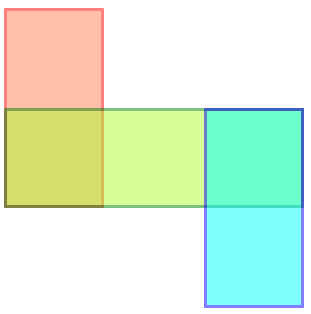
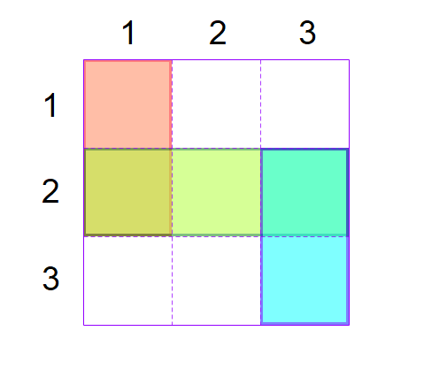

# WpfGridLayout.Blazor
Provide a simple way to create a grid layout like WPF in Blazor

## Quick Start

To create a grid layout for arrange your components, open a ```Grid``` tag and set up column and row definitions

```
<Grid>
    <ColumnDefinitions>
        <ColumnDefinition Width="100"/>
        <ColumnDefinition Width="100"/>
        <ColumnDefinition Width="100"/>
    </ColumnDefinitions>
    <RowDefinitions>
        <RowDefinition Height="100" />
        <RowDefinition Height="100" />
        <RowDefinition Height="100" />
    </RowDefinitions>
    
    <Content>
        <GridElement Row="1" RowSpan="2">
            <div class="first" />
        </GridElement>
        <GridElement Row="2" ColumnSpan="3">
            <div class="second" />
        </GridElement>
        <GridElement Row="2" Column="3" RowSpan="3">
            <div class="third" />
        </GridElement>
    </Content>
</Grid>

<style>
    .first {
        border: solid red;
        background-color: coral;
        opacity: 0.5;
    }

    .second {
        border: solid green;
        background-color: greenyellow;
        opacity: 0.5;
    }
    .third {
        border: solid blue;
        background-color: aqua;
        opacity: 0.5;
    }
</style>
```



## Some basics

A grid layout consists of a container divided in columns and rows for making web pages or components by arranging and supperposing elements between them.

To achieve this goal, each column and row has a position depending on his display order, and you can place an element on the grid by defining the starting row and column position as well as the ending row and column position.

When elements share the same cell, the order of superposition is done according to their declaration order.



> Notice that the row and column indexes start with the number 1 and not 0

## Getting Started
Few steps are required in order to use the library.

#### Add NuGet
```
Install-Package WpfGridLayout.Blazor
```

#### Configure _Imports.razor
```
...
@using WpfGridLayout.Blazor
```

That's all !

## Usage

### Grid

Your grid is enclosed by ```<Grid></Grid>``` 

This tag can contains extra attributes :

| Attribute name  | Description| Value| Default Value |
|--|--|--|--|
| Width | Specify a fixed width for the grid | a number representing the size in px | 100% of its container
| Height | Specify a fixed height for the grid | a number representing the size in px | 100% of its container
| ColumnGap  | Specify the width of the gap separating the **columns** | a number representing the size in px | empty
| RowGap  | Specify the width of the gap separating the **rows** | a number representing the size in px | empty

*Example*
```
<Grid ColumnGap="10" RowGap="20" Width="200" Height="100">
...
</Grid>
```

### ColumnDefinitions

By default, the grid layout contains only one column. For create more, add some ```<ColumnDefinition />``` tags wrapped into a ```<ColumnDefinitions></ColumnDefinitions> ```

*Example: create a grid layout with 3 columns*

```
<Grid>
	<ColumnDefinitions>
		<ColumnDefinition />
		<ColumnDefinition />
		<ColumnDefinition />
	</ColumnDefinitions>
	...
</Grid>
```
Each ```<ColumnDefinition />``` can set up the following attributes :

| Attribute name | Description | Value | Default value |
|--|--|--|--|
| Width | The column width  | The value can be **\***, **Auto** or a **fixed number**. See the [size section](https://github.com/aboudoux/WpfGridLayout.Blazor/tree/readme#size) for more details | *
| MinWidth | The minimum size for which the column will not resize | The value must be a **fixed number** (in px) | empty
| MaxWidth | The maximum size for which the column will not resize  | The value must be a **fixed number** (in px) | empty

*Example :*
```
<Grid>
	<ColumnDefinitions>
		<ColumnDefinition Width="*" MinWidth="50"/>
		<ColumnDefinition Width="2*" />
		<ColumnDefinition Width="Auto" MaxWidth="200"/>
		<ColumnDefinition Width="25" />
	</ColumnDefinitions>
	...
</Grid>
```


### RowDefinitions

By default, the grid layout contains only one row. For create more, add some ```<RowDefinition />``` tags wrapped into a ```<RowDefinitions></RowDefinitions> ```

*Example: create a grid layout with 2 rows*
```
<Grid>
	<RowDefinitions>
		<RowDefinition />
		<RowDefinition />		
	</RowDefinitions>
	...
</Grid>
```
Each ```<RowDefinition />``` can have set up following attributes :

| Attribute name | Description | Value | Default value |
|--|--|--|--|
| Height| The row height| The value can be **\***, **Auto** or a **fixed number**.  See the [size section](https://github.com/aboudoux/WpfGridLayout.Blazor/tree/readme#size) for more details | *
| MinHeight | The minimum size for which the row will not resize | The value must be a **fixed number** (in px) | empty
| MaxHeight | The maximum size for which the row will not resize | The value must be a **fixed number** (in px) | empty

*Example :*
```
<Grid>
	<RowDefinitions>
		<RowDefinition Height="*" MinHeight="50"/>
		<RowDefinition Height="2*" />
		<RowDefinition Height="Auto" MaxHeight="200"/>
		<RowDefinition Height="25" />
	</RowDefinitions>
	...
</Grid>
```

### Content
Once your grid is set up, you will be able to arrange your components by defining it's content.

For that, enclose some ```<GridElement>``` into the ```<Content></Content>``` tag like below

```
<Grid>
...
	<Content>
		<GridElement Row="1" Column="1">
			<h1>Hello</h1>
		</GridElement>
		<GridElement  Row="1" Column="2">
			<h1>World !</h1>
		</GridElement>
	</Content>
</Grid>
```
The ```<GridElement>``` wrap some Html or Blazor component and use the following attributes to handle it's position on the grid :

| Attribute name | Description  | Default
|--|--|--|
| Row | The row number where the element start. Row numbering begins with 1 | 1 |
| Column | The column number where the element start. Column numbering begins with 1 | 1|
| RowSpan | The row number where the element end. | 1|
| ColumnSpan | The column number where the element end.  | 1|
| HorizontalAlignment | Defines how to position the element on the horizontal axis. See [Alignment section](https://github.com/aboudoux/WpfGridLayout.Blazor/blob/readme/README.md#alignment) for details  | ```@Alignment.Stretch```|
| VerticalAlignment|Defines how to position the element on the vertical axis. See [Alignment section](https://github.com/aboudoux/WpfGridLayout.Blazor/blob/readme/README.md#alignment) for details|```@Alignment.Stretch```|

## Standard

#### Size

- **\*** : Takes as much space as available (after filling all auto and fixed sized columns), proportionally divided over all star-sized columns. So 3*/5* means the same as 30*/50*.
- **Auto** : Takes as much space as needed by the contained control
- **Fixed Number** : Set a number of pixel

#### Alignment
Here's are the values used by ```HorizontalAlignment``` and ```VerticalAlignment``` attributes

|Value| Disposition for HorizontalAlignment | Disposition for VerticalAlignment |
|--|--|--|
| **```@Alignment.Start```** | Left  | Top |
|**```@Alignment.Center```**  | Center | Center |
|**```@Alignment.End```**  | Right | Bottom |
|**```@Alignment.Stretch```**  | Full width  | Full height |

> Warning : some unexpected behaviors in the alignments may appear due to another css override. You can fix this problems by reseting corresponding values with some extra css.

> Example
> ```
> <style>
>    label { /* reset bootstrap settings for label*/
>        margin: 0;
>        padding: 0;
>    }
> </style>
> ```

## Authors
WpfGridLayout.Blazor is created by [Aurelien BOUDOUX](http://aurelien.boudoux.fr).

Contributions are welcome!

## Want to see a real project based on WpfGridLayout.Blazor ?

Take a look at the [main component](https://github.com/aboudoux/TetrisBlazor/blob/master/Tetris.Blazor/Tetris.razor) of [TetrisBlazor project](https://github.com/aboudoux/TetrisBlazor) to see WpfGridLayout.Blazor in action !

## Change log

### 1.2.0 
- [Improvement] The grid completely fills the size of its container by default

### 1.1.0 
- [New] Add Width & Height attributes to the Grid element
- [Bugfix] Error in stack order of elements

### 1.0.0
- First release of the component

## License
WpfGridLayout.Blazor is MIT licensed.
